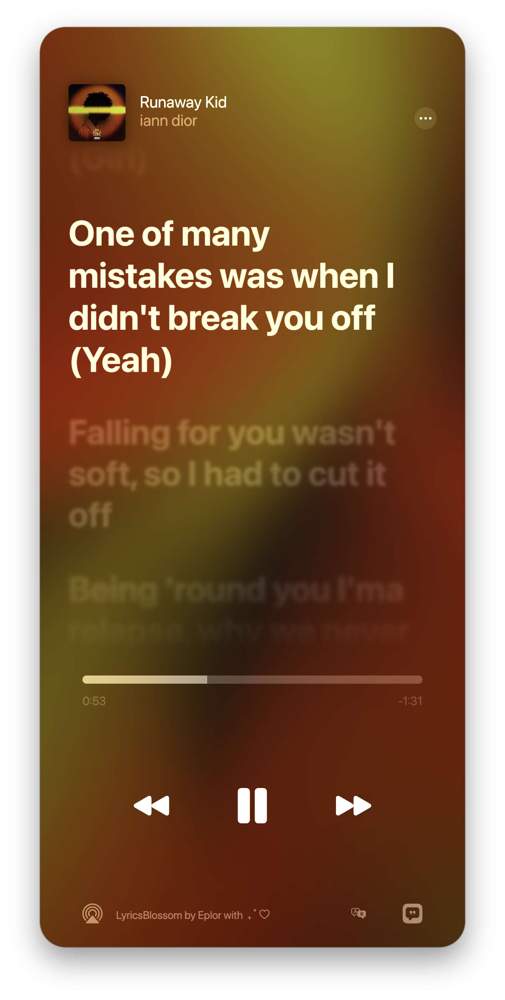
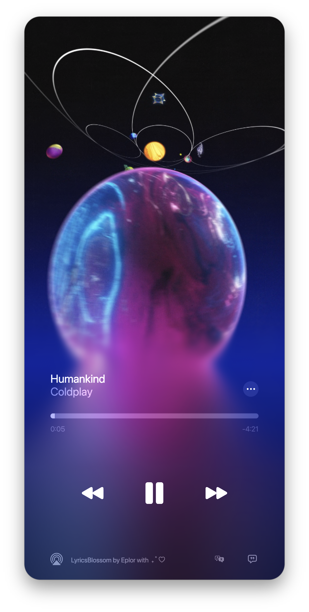
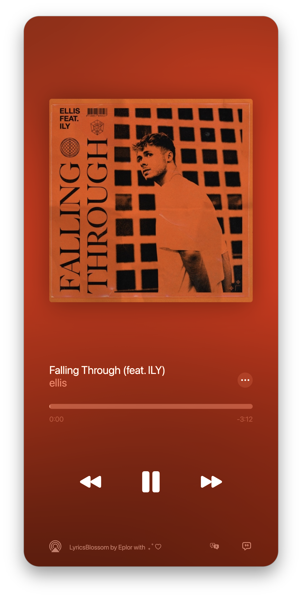
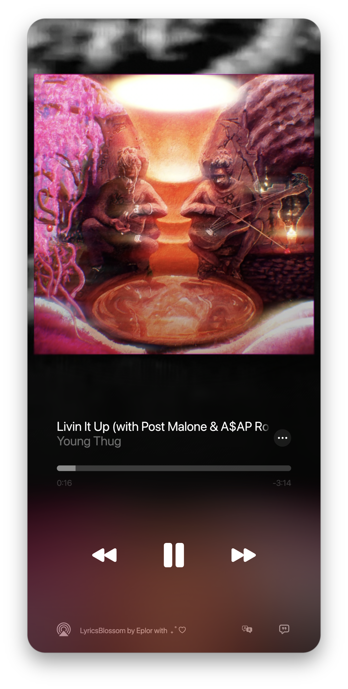

<div align="left">

# 🌸 LyricsBlossom

**为歌词而生**

[](https://github.com/Eplorr/LyricsBlossom/releases/latest)
[](#license)

**简体中文** · [English](./README.en.md)

---

## 完美还原。毫厘不差。

迄今为止最完美的 Apple Music 歌词体验还原。

逐词歌词、动态封面、动态律动背景 — 一切如你所见，一如其名。

**1:1 原生还原** · Apple Music 级别的歌词体验，细节之处皆是讲究。

**GPU 加速** · 基于 Skia 构建，为每个平台选用最合适的图形后端。

- **macOS** — Metal
- **Windows** — Vulkan

---

## 下载

前往 **[Releases](https://github.com/Eplorr/LyricsBlossom/releases/latest)** 获取最新版本。

---

## 系统要求

|  | macOS | Windows |
|:---|:---|:---|
| **系统版本** | macOS 13 或更高 | Windows 10 1809 或更高 |
| **动态律动背景** | 需要 macOS 14 或更高 | 全版本支持 |
| **图形后端** | Metal | Vulkan |

---

## 开始使用

### 歌词来源

LyricsBlossom 通过你的 **Apple Music 账户** 获取逐词同步歌词。在「设置」页面的账户卡片上点击 **登录** 即可完成授权；Token 过期时，表现为获取不到 Apple Music 歌词 / 动态封面，在同样的位置重新登录即可。

> 未登录 Apple Music 账户、或没有有效的 Apple Music 订阅时，将无法获取 Apple Music 歌词及对应的动态封面。建议在「设置」中关闭 **Apple Music 最高优先级**，以获得更佳的回退效果。

软件同时支持多个备选歌词源，按优先级自动选择：

- **[AMLL](https://github.com/amll-dev/amll-ttml-db)** — 社区维护的 TTML 逐词歌词库
- **QQ 音乐**
- **网易云音乐**

### macOS 安装

若遇到「文件已损坏」提示，在终端执行：

```bash
sudo xattr -cr /Applications/LyricsBlossom.app
```

> 若 .app 不在 `/Applications`，请替换为实际路径。

### Windows 配置

配合网易云音乐使用时，请安装 [BetterNCM](https://std.microblock.cc/betterncm) 及其 **InfLink-rs** 插件，以获得完整的曲目信息与高清封面。

---

## 歌词同步

### 全局补偿

歌词右上角的 **＋** 与 **−** 按钮，以 **50 ms** 为步长，对整体时间轴进行全局补偿 — 让歌词与你的播放器精确对齐。

### 快速同步（macOS）

如发现软件内时间与播放器时间不一致，**按一下暂停、再播放** 即可触发重新同步。

---

## 快捷键

| 按键 | 功能 |
|:---:|:---|
| `Space` | 暂停 / 播放 |
| `←` `→` | 上一首 / 下一首 |

---

## 截图

<div align="center">





</div>

---

## 常见问题

<details>
<summary><b>播放进度与歌词不同步</b></summary>

先确认软件显示的进度是否与播放器一致。如果不一致，按 `Space` 暂停再恢复即可重新同步。

若进度一致但歌词仍有偏差，可能是播放器音源与 对应歌词歌源 之间的时间轴差异所致。使用歌词右上角的 **＋** / **−** 按钮进行手动补偿即可。

</details>

<details>
<summary><b>无法识别网易云音乐</b></summary>

网易云音乐自身不上报 SMTC 信息，或上报的信息不完整。需安装 [BetterNCM](https://std.microblock.cc/betterncm) 及其 **InfLink-rs** 插件后方可正常使用。

</details>

<details>
<summary><b>Apple Music UWP 无法响应进度跳转</b></summary>

Apple Music UWP 版本不支持通过 SMTC 接口进行进度跳转 — 这是播放器自身的限制，非软件所能控制。

</details>

<details>
<summary><b>部分播放器信息有误</b></summary>

部分软件（如 QQ 音乐）上报的 SMTC 数据存在误差或字段缺失。这是播放器的实现问题，LyricsBlossom 无法加以干预。

</details>

<details>
<summary><b>获取不到 Apple Music 歌词与动态封面</b></summary>

需登录有效的 Apple Music 账户，且订阅状态正常。若不希望使用 Apple Music 源，可在「设置」中关闭 **Apple Music 最高优先级**，软件将自动选择其他可用歌词源。

</details>

<details>
<summary><b>封面模糊</b></summary>

封面取自播放器上报给系统（SMTC / Now Playing）的图像。部分播放器仅上报缩略图，此时封面会较为模糊 — 这不是软件本身的问题。可以在软件设置内打开 "获取高清封面" 来解决。

</details>

<details>
<summary><b>高清封面获取与实际封面不符</b></summary>

可能是版本选择错误导致，可以在 "歌词..." 设置页面中选择正确的对应版本获取到相对应的封面。此操作需要配合 "获取高清封面" 使用。

</details>

<details>
<summary><b>macOS 掉帧</b></summary>

通常由 macOS WindowServer 调度所致。Safari 会占用大量合成资源 — 无需关闭，`⌘H` 隐藏即可缓解。

</details>

---

## 反馈

- **Bug 报告与功能建议** · [GitHub Issues](https://github.com/Eplorr/LyricsBlossom/issues)
- **QQ 交流群** · [点击链接加入群聊【LyricsBlossom 交流群】](https://qm.qq.com/q/fz4cjWKjQc)

反馈 Bug 时，请附上操作系统版本与复现步骤。

---

## License

**LyricsBlossom is proprietary software. All rights reserved.**

本项目为闭源软件，仅供个人使用。未经许可，禁止复制、修改、分发或倒卖。

See [LICENSE](LICENSE) for details.

</div>
